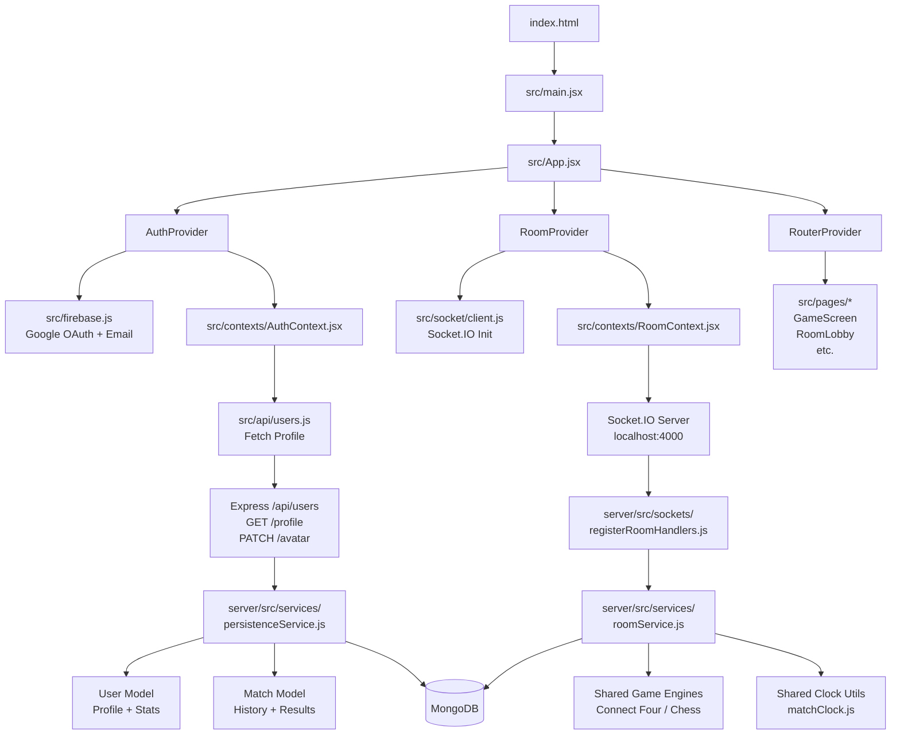

# GameArena — Online Multiplayer Gaming Platform

A modern, real-time 2-player gaming platform with **full multiplayer support**, **server-authoritative timers**, **rejoin grace periods**, and **rich game modes**. Built with React, Node.js, Socket.IO, and MongoDB.


---

## 🎮 Games & Features

| Game | Description | AI Depth | Bot Support |
|------|-------------|----------|-------------|
| **Chess** | Full FEN-based state, move validation, pawn promotion | Minimax depth 2 | ✅ |
| **Connect Four** | 7×6 board, win detection, piece scoring | Minimax depth 5 w/ alpha-beta pruning | ✅ |
| **Battleship** | *(In progress)* Ship placement + grid targeting | Strategic hunt patterns | ✅ |

## 🎯 Game Modes

- **vs Bot** — Play against AI with configurable difficulty, 10-minute per-player timer
- **Local 2 Player** — Pass-and-play with random avatar pairs, 10-minute per-player timer
- **Multiplayer Online** — Real-time 2-player via Socket.IO rooms with:
  - 30-second reconnect grace period (pause & wait)
  - 10-minute per-player chess clock (server authoritative)
  - Move validation on server (cheating-proof)
  - Auto-forfeit on inactivity timeout or disconnect expiry
  - Rematch voting system

## ✨ Core Features

### Authentication
- **Firebase** (Google OAuth + Email/Password)
- **Guest mode** with localStorage persistence
- Profile sync across device refreshes
- Avatar selection (8 preset styles)

### Multiplayer Resilience
- **Unified disconnect/leave grace** — 30-second window to rejoin before forfeit
- **Server-authoritative clocks** — 10 minutes per player, auto-timeout loss
- **Move pause during absence** — Game blocked while opponent reconnects
- **Stale socket protection** — Ignores disconnect events from old sockets after reconnect

### User Experience
- Dark-themed UI with Tailwind CSS
- Fully responsive (mobile, tablet, desktop)
- Real-time countdown in-game for opponent absence
- Clock display with low-time (< 60s) styling
- Rematch button with voting

### Stats & Persistence
- MongoDB user profiles (wins/losses/draws)
- Match history with game details
- Per-game statistics dashboard
- Result persistence during multiplayer auto-forfeit

---

## 🏗️ Architecture

### Frontend Stack

| Layer | Technology |
|-------|-----------|
| **Framework** | React 19 |
| **Build Tool** | Vite 7 |
| **Styling** | Tailwind CSS v4 |
| **Routing** | react-router-dom v7 |
| **Real-time** | Socket.IO client |
| **Auth** | Firebase + localStorage |
| **Chess Engine** | chess.js + react-chessboard |
| **UI Icons** | Lucide React |
| **Animations** | Framer Motion |

### Backend Stack

| Layer | Technology |
|-------|-----------|
| **Runtime** | Node.js 22 |
| **Web Framework** | Express.js |
| **Real-time** | Socket.IO 4 |
| **Database** | MongoDB 7 |
| **Auth** | Firebase (client-side token validation) |
| **Game Engines** | Shared JS modules (Connect Four, Chess) |

---

## 📁 Project Structure

### Frontend (`src/`)

```
src/
├── api/
│   ├── users.js                 # User profile fetch & avatar update
│   └── matches.js               # Match history & save
├── components/
│   ├── games/
│   │   ├── ChessGame.jsx        # Chess UI + local/bot/multiplayer modes
│   │   ├── ConnectFourGame.jsx  # Connect Four UI + all modes
│   │   └── BattleshipGame.jsx   # Battleship (in progress)
│   ├── Button.jsx               # Reusable button component
│   ├── GameCard.jsx             # Game card with preview
│   ├── InputField.jsx           # Reusable input field
│   ├── Navbar.jsx               # Public navbar
│   ├── PlayerCard.jsx           # Player status card
│   ├── ProtectedRoute.jsx       # Auth guard wrapper
│   └── Sidebar.jsx              # Dashboard navigation
├── contexts/
│   ├── AuthContext.jsx          # Firebase + guest auth
│   └── RoomContext.jsx          # Socket.IO room state & events
├── game-engines/
│   ├── chess/
│   │   ├── engine.js            # Move validation, status
│   │   └── index.js             # Re-exports
│   ├── connectFour/
│   │   ├── engine.js            # Minimax AI + validation
│   │   └── index.js             # Re-exports
│   └── battleship/
│       └── engine.js            # (In progress)
├── hooks/
│   └── useGameStats.js          # Match stats fetching & caching
├── layouts/
│   ├── DashboardLayout.jsx      # Sidebar + outlet layout
│   ├── GameLayout.jsx           # Full-screen game layout
│   ├── PublicLayout.jsx         # Public pages layout
│   └── index.js                 # Layout re-exports
├── pages/
│   ├── CreateRoomPage.jsx       # Room creation UI
│   ├── DashboardPage.jsx        # Game library & selection
│   ├── GameScreen.jsx           # Main game renderer (multiplayer/local/bot)
│   ├── HomePage.jsx             # Dashboard home with stats
│   ├── JoinRoomPage.jsx         # Room join by code
│   ├── LandingPage.jsx          # Public landing page
│   ├── LoginPage.jsx            # Firebase login form
│   ├── ProfilePage.jsx          # User profile & avatar picker
│   ├── RoomLobbyPage.jsx        # Pre-game room lobby
│   ├── SignupPage.jsx           # Firebase signup form
│   └── index.js                 # Page re-exports
├── router/
│   └── index.jsx                # React Router configuration
├── socket/
│   └── client.js                # Socket.IO initialization
├── utils/
│   ├── avatarMap.js             # Preset avatar URLs
│   ├── guestIdentity.js         # Guest badge formatting
│   ├── matchAvatarUtils.js      # Avatar assignment per mode
│   └── matchClock.js            # **Shared clock utility** (local + server)
├── firebase.js                  # Firebase initialization
├── index.css                    # Tailwind + theme tokens
└── main.jsx                     # React entry point
```

### Backend (`server/src/`)

```
server/
├── config.js                    # Environment variables
├── index.js                     # Server bootstrap + Socket.IO setup
├── app.js                       # Express app creation
├── db/
│   └── connect.js              # MongoDB connection
├── models/
│   ├── User.js                 # User schema (uid, stats, avatar)
│   └── Match.js                # Match schema (gameId, result, players)
├── routes/
│   ├── matchRoutes.js          # GET /matches, POST /matches
│   └── userRoutes.js           # GET /users/profile, PATCH /users/avatar
├── services/
│   ├── roomService.js          # **Core room logic** (state, moves, timers, grace)
│   └── persistenceService.js   # MongoDB CRUD for users & matches
├── sockets/
│   ├── index.js                # Socket handler registration
│   └── registerRoomHandlers.js # room:* events (join, leave, move, rematch)
├── store/
│   └── roomStore.js            # In-memory room store (Map-based)
├── game/
│   ├── connectFourState.js     # Game state initializer (re-export)
│   └── chessState.js           # Game state initializer (re-export)
└── utils/
    └── roomCode.js             # Unique room code generator
```

---

## 🚀 Data Flow Diagram



---

## 🔄 Multiplayer Workflow

### 1. **Create Room** (`CreateRoomPage.jsx`)
```
Player 1 clicks "Create Room"
  ↓
RoomContext emits socket: room:create { playerId, displayName, avatarId, gameId }
  ↓
RoomService creates room (roomCode, seat 1, status: waiting)
  ↓
Server broadcasts: room:state
  ↓
Player redirects to: /room/:roomCode
```

### 2. **Join Room** (`JoinRoomPage.jsx` → `RoomLobbyPage.jsx`)
```
Player 2 enters room code
  ↓
RoomContext emits socket: room:join { roomCode, playerId, displayName, avatarId }
  ↓
RoomService verifies room exists, adds Player 2 (seat 2)
  ↓
Server broadcasts: room:state to all players in room
  ↓
Both players see lobby with 2/2 slots filled
```

### 3. **Start Game** (`RoomLobbyPage.jsx` → `/game/:gameId?roomCode=...`)
```
Player 1 (host) clicks "Start Game"
  ↓
RoomContext emits socket: room:start { roomCode, playerId }
  ↓
RoomService:
  - Sets room status = ACTIVE
  - Initializes gameState (Connect Four / Chess FEN)
  - Creates match clock (10 min per player)
  - Starts clock timeout timer
  ↓
Server broadcasts: room:state with clock
  ↓
GameScreen receives room + clock, renders game UI
```

### 4. **Play & Move** (`GameScreen.jsx` → Game Component)
```
Player 1 makes move (column / chess move)
  ↓
GameScreen calls: RoomContext.makeMove(move, roomCode)
  ↓
RoomContext emits socket: make_move { roomCode, playerId, move/column }
  ↓
RoomService:
  - Checks move validity
  - Updates gameState
  - Switches clock turn
  - Checks for timeout (auto-lose)
  - Persists result if game ends
  ↓
Server broadcasts: room:state
  ↓
Both players see updated board + clock
```

### 5. **Disconnect/Leave** (`GameScreen.jsx` + socket disconnect)
```
Player leaves or network drops
  ↓
RoomService marks player: connected = false, disconnectGraceUntil = now + 30s
  ↓
Server pauses clock, schedules absence timer
  ↓
Server broadcasts: room:state with absence { playerId, remainingMs }
  ↓
Opponent sees: "Opponent left/disconnected. Waiting for reconnection... 30s"
  ↓
Moves blocked for both players
```

### 6. **Rejoin Within Grace** (`GameScreen.jsx` refreshes → auto-join)
```
Player 1 refreshes browser (new socket)
  ↓
GameScreen calls: RoomContext.joinRoom(roomCode)
  ↓
RoomContext emits socket: room:join { roomCode, playerId, ... }
  ↓
RoomService:
  - Finds existing player by playerId
  - Updates socket ID
  - Clears absence (disconnectGraceUntil = null)
  - Resumes clock
  ↓
Server broadcasts: room:state (absence cleared)
  ↓
Opponent sees countdown disappear; game resumes
```

### 7. **Grace Expires (No Rejoin)** (server absence timer fires)
```
30 seconds elapsed without reconnect
  ↓
RoomService auto-finishes room:
  - Sets status = FINISHED
  - Creates game result: opponent wins (forfeit)
  - Pauses clock
  ↓
Server broadcasts: room:state
  ↓
Both players see game over: "Opponent forfeited due to inactivity"
  ↓
Persists to MongoDB (match history)
```

### 8. **Clock Timeout** (during play)
```
Active player's clock reaches 0:00
  ↓
Server clock timeout timer fires
  ↓
RoomService:
  - Detects timeout via checkMatchClockTimeout()
  - Auto-finishes room: opposite player wins
  - Pauses clock
  ↓
Server broadcasts: room:state
  ↓
Both players see: "Opponent lost on time"
```

### 9. **Rematch** (`GameScreen.jsx`)
```
Both players click "Rematch" button
  ↓
RoomContext emits socket: rematch:request { roomCode, playerId }
  ↓
RoomService toggles rematchVotes[playerId] = true
  ↓
If both players voted:
  - Resets gameState (new FEN / new board)
  - Resets clock (10 min each)
  - Status = ACTIVE
  ↓
Server broadcasts: room:state
  ↓
Game screen auto-resets; new match starts
```

---

## 🛠️ Server-Side Core Logic

### RoomService (src/services/roomService.js)

**Key Methods:**
- `createRoom()` — Initialize room, host gets seat 1
- `joinRoom()` — Add/rejoin player, auto-rejoin within grace
- `startGame()` — Initialize clock + game state
- `makeMove()` — Validate + apply move, switch turn, check timeout
- `leaveRoom()` — Mark player absent + start grace timer
- `markDisconnected()` — Handle socket disconnect (same as leave)
- `requestRematch()` — Vote, auto-reset if both agree

**Automatic Actions:**
- **Clock Timeout:** If active player clock ≤ 0, auto-finish (forfeit)
- **Absence Timeout:** If player grace expires, auto-finish (forfeit)
- **Stale Socket Ignore:** Discard disconnect from old socket after rejoin
- **Resume on Rejoin:** Auto-resume clock when reconnected within grace

### Socket Events (registerRoomHandlers.js)

| Event | Direction | Payload |
|-------|-----------|---------|
| `room:create` | C→S | `{ playerId, displayName, avatarId, gameId }` |
| `room:join` | C→S | `{ roomCode, playerId, displayName, avatarId }` |
| `room:start` | C→S | `{ roomCode, playerId }` |
| `room:get-state` | C→S | `{ roomCode }` |
| `room:leave` | C→S | `{ roomCode, playerId }` |
| `make_move` | C→S | `{ roomCode, playerId, column/move }` |
| `rematch:request` | C→S | `{ roomCode, playerId }` |
| `room:state` | S→C | Full room snapshot (broadcast) |

---

## 📊 Database Schema

### User
```javascript
{
  uid: String (unique),
  displayName: String,
  avatarId: String (enum: avatar1–8),
  stats: {
    wins: Number,
    losses: Number,
    draws: Number
  },
  createdAt: Date
}
```

### Match
```javascript
{
  gameId: String (connect-four, chess, battleship),
  mode: String (multiplayer),
  players: [{ uid, displayName }],
  userOutcomes: [{ uid, result: win|loss|draw }],
  winner: String (uid or 'draw'),
  status: String ('finished'),
  outcome: String,
  detail: String (optional),
  createdAt: Date,
  finishedAt: Date
}
```

---

## 🧪 Local Development

### Prerequisites

- **Node.js** 18+
- **npm** 9+
- **MongoDB** (local or Atlas connection string)
- **Firebase** credentials (optional for auth)

### Environment Setup

**Frontend** (`.env.local`):
```
VITE_SOCKET_URL=http://localhost:4000
VITE_API_URL=http://localhost:4000
VITE_FIREBASE_API_KEY=xxx
VITE_FIREBASE_AUTH_DOMAIN=xxx
VITE_FIREBASE_PROJECT_ID=xxx
VITE_FIREBASE_APP_ID=xxx
VITE_FIREBASE_MESSAGING_SENDER_ID=xxx
VITE_FIREBASE_STORAGE_BUCKET=xxx
```

**Backend** (`server/.env`):
```
PORT=4000
DATABASE_URL=mongodb://localhost:27017/gamearena
CLIENT_ORIGIN=http://localhost:5173
NODE_ENV=development
```

### Running Locally

**Terminal 1 — Backend:**
```bash
cd server
npm install
npm run dev
# Starts Socket.IO + Express on http://localhost:4000
```

**Terminal 2 — Frontend:**
```bash
npm install
npm run dev
# Starts Vite on http://localhost:5173
```

### Building for Production

**Frontend:**
```bash
npm run build
# Outputs: dist/
```

**Backend:**
```bash
cd server
npm start
# Runs from compiled src/ with production NODE_ENV
```

---

## 🧠 Key Technical Highlights

### 1. Server-Authoritative Clocks
- Client receives raw clock baseline from server
- Client resolves elapsed time locally (updates UI)
- Server independently checks for timeout
- No client-side clock tampering possible

### 2. Unified Absence Flow
- Same code path for disconnect & intentional leave
- 30-second grace window to rejoin
- Auto-forfeit on grace expiry (persisted to DB)
- Moves blocked during absence (ROOM_PAUSED error)

### 3. Stale Socket Protection
- After reconnect, old socket's disconnect event ignored
- Checks: `if (player.socketId && player.socketId !== incomingSocketId) return`
- Prevents false absence from delayed events

### 4. Shared Game Logic
- Move validation on server (prevents cheating)
- Game engines (chess.js, Connect Four minimax) run in Node.js
- Client receives immutable game state snapshots
- Client only renders (no local state mutation in multiplayer)

### 5. Transactional Match Results
- On game finish or forfeit, result persists **immediately**
- Match record created before game screen can be dismissed
- Prevents loss of history on page reload
- Stats updated atomically in MongoDB

---

## 🎯 Future Roadmap

- [ ] **Elo rating system** — Skill-based rankings
- [ ] **Matchmaking queue** — Auto-pair similar skill players
- [ ] **Spectator mode** — Watch ongoing matches
- [ ] **Voice chat** — In-game audio communication
- [ ] **More games** — Checkers, Reversi, Mancala, Tic Tac Toe
- [ ] **Sound effects** — Move & win audio
- [ ] **Replay system** — Review past games
- [ ] **Tournaments** — Multi-round competitive events
- [ ] **Mobile app** — React Native version
- [ ] **AI improvements** — Deeper minimax, opening books

---

## 📝 License

This project is for personal and educational use.

---

## 👤 Author

**Puranjay** — Full-stack development with real-time multiplayer focus.

---

## 🙏 Acknowledgments

- **chess.js** + **react-chessboard** for chess engine & UI
- **Socket.IO** for real-time communication
- **Firebase** for authentication
- **MongoDB** for persistence
- **React**, **Vite**, **Tailwind CSS** for front-end stack
